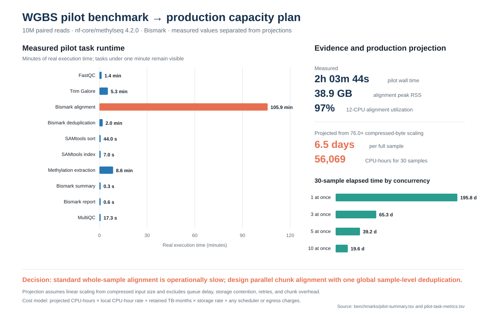

# Reproducible WGBS processing with nf-core/methylseq

This repository is the training and operations guide for processing paired-end whole-genome bisulfite sequencing (WGBS) data with [nf-core/methylseq](https://nf-co.re/methylseq), Nextflow, Singularity, and Slurm.

The workflow is species-independent. Human GRCh38 is the initial project reference, while the same method supports other species by supplying the appropriate assembly FASTA and building a matching Bismark index.

Bioinformatics tools are supplied automatically through nf-core's versioned containers. Users install or load only the host prerequisites—Java, Nextflow, Git, and a container engine—and configure their local storage and scheduler settings once.

It is intentionally written for scientists who are new to bioinformatics. The repository does not contain sequencing data, credentials, private server names, or institution-specific paths.

## What the workflow does

```text
paired FASTQ files
  -> read-quality assessment
  -> adapter and quality trimming
  -> Bismark alignment
  -> whole-sample duplicate removal
  -> methylation extraction
  -> coverage files and quality-control reports
```

The production workflow processes each sample as a complete paired-end dataset. A small, temporary subset may be created for installation and performance testing; it must not be interpreted as a biologically complete sample.

## Benchmark deliverable

[The 10M real-data pilot benchmark and capacity plan](docs/16-pilot-benchmark-and-capacity-plan.md) records measured runtime, CPU efficiency, peak memory, I/O, full-sample projections, cohort concurrency scenarios, a rate-based cost model, limitations, and the engineering decision that motivates chunked-alignment planning.



## Start here

1. Use the concise [operator checklist from clone to pilot](docs/15-operator-checklist.md); follow its linked detailed guides when a concept or command is unfamiliar.
2. Follow [zero to verified smoke test](docs/00-zero-to-smoke-test.md) exactly. It is the complete beginner runbook through the current validated checkpoint.
3. For a laptop or workstation, use [install and test on your own computer](docs/11-install-on-your-computer.md).
4. Read [containers and portability](docs/12-containers-and-portability.md).
5. Read [WGBS concepts](docs/01-wgbs-concepts.md) and [computing concepts](docs/02-computing-concepts.md).
6. Prepare a samplesheet using [the input guide](docs/04-inputs.md).
7. Confirm the [reference and Bismark index](docs/10-reference-and-bismark-index.md).
8. Run the [10-million-read-pair pilot](docs/05-pilot.md).
9. Learn how to [monitor and interpret the run](docs/06-monitoring-and-results.md).
10. Consult [troubleshooting](docs/07-troubleshooting.md) when a command fails.
11. Review the sanitized [validation log](docs/09-validation-log.md) to see what has already been tested.
12. Create a private [run manifest](docs/13-run-manifests.md) for every pilot and production execution.
13. Use the optional [production preflight gate](docs/14-production-preflight.md) before submitting full samples.
14. Review the [pilot benchmark and production capacity plan](docs/16-pilot-benchmark-and-capacity-plan.md) before selecting production concurrency or developing chunked alignment.
15. When large storage is assigned, complete the [deferred production setup](docs/17-production-setup.md) and guarded production launcher.
16. Use the staged [pilot → one full sample → 30-sample production qualification](docs/18-pilot-to-production.md) before launching a cohort.

The shorter [installation reference](docs/03-installation.md) and [smoke-test reference](docs/05-smoke-test.md) are for returning users. First-time users should use the linear runbook.

## Reproducibility policy

- Nextflow is pinned with `NXF_VER`.
- nf-core/methylseq is pinned with `-r`.
- Software executes in versioned containers.
- References must be identified by source, release, and checksum.
- Pipeline parameters are stored in YAML files.
- Site-specific paths and Slurm options live in an untracked local configuration.
- Nextflow trace, report, timeline, DAG, and software-version outputs are retained.

See [reproducibility and provenance](docs/08-reproducibility.md).

## Current validated environment

The initial setup was validated with:

- Nextflow launcher with framework version `25.10.7`
- Java `18.0.1.1` supplied by an environment module
- Singularity CE `4.0.3`
- SeqKit `2.8.2` executed from a Biocontainer
- Slurm as the workflow executor

These versions are documented facts from the initial setup, not permanent requirements. Changes must be tested and recorded in `CHANGELOG.md`.

## Security and privacy

Never commit:

- server hostnames or IP addresses;
- usernames, passwords, SSH keys, or tokens;
- internal email addresses;
- protected sample identifiers;
- absolute institutional storage paths;
- scheduler account or private partition names;
- job logs containing private paths.

Tracked examples use placeholders such as `/project/xxx`, `user@xxx`, and `login.xxx`.

## Status

Environment bootstrap, Slurm execution, container execution, the nf-core/methylseq smoke test, construction of the matching GRCh38 Bismark index, and the 10-million-read-pair human WGBS pilot have been validated. One complete sample is now undergoing production qualification; its results will not be described as validated until the workflow finishes and its MultiQC, required outputs, trace, and provenance are reviewed.

The portable `conf/site.env` launcher has passed repository checks and a repeat Slurm smoke test.

Repository quality checks validate shell syntax, whitespace, and executable permissions on every push and pull request.
